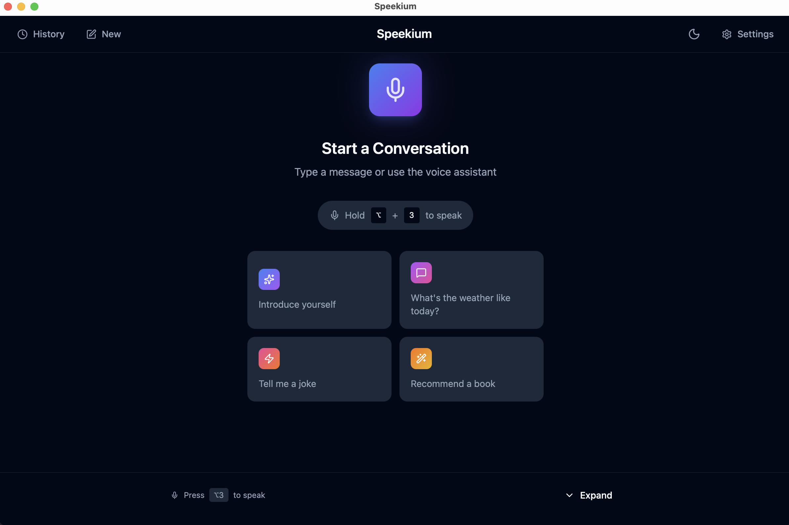
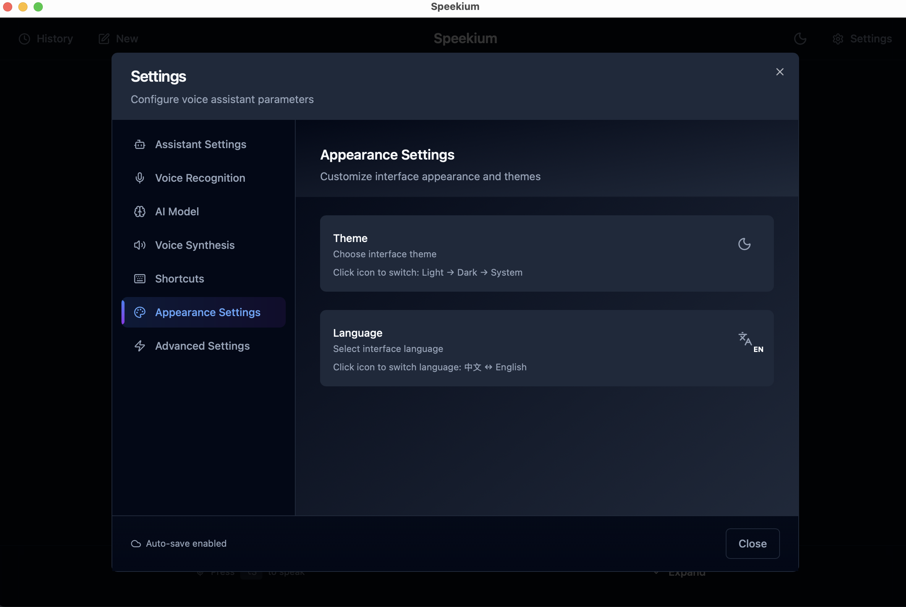

<p align="center">
  
</p>

<h1 align="center">Speekium</h1>

<p align="center">
  <strong>Open-source voice assistant that respects your privacy.</strong>
</p>

<p align="center">
  <a href="./README_CN.md">中文</a> •
  <a href="#features">Features</a> •
  <a href="#installation">Installation</a> •
  <a href="#quick-start">Quick Start</a> •
  <a href="#configuration">Configuration</a>
</p>

<p align="center">
  <a href="https://github.com/kanweiwei/speekium/releases"></a>
  
  
  <a href="https://github.com/kanweiwei/speekium/stargazers"></a>
</p>

<p align="center">
  
  
  
  
</p>

---

<p align="center">
  
</p>

## Why Speekium?

| Feature | Speekium | Siri/Alexa | ChatGPT Voice |
|---------|:--------:|:----------:|:-------------:|
| **Runs locally** | ✅ | ❌ | ❌ |
| **Your data stays private** | ✅ | ❌ | ❌ |
| **Choose your own LLM** | ✅ | ❌ | ❌ |
| **Open source** | ✅ | ❌ | ❌ |
| **Works offline** | ✅ | ❌ | ❌ |
| **No subscription required** | ✅ | ✅ | ❌ |

## Features

### Voice Input Modes
- **Push-to-Talk (PTT)**: Hold hotkey to record, release to send
- **Continuous Mode**: Auto-detect voice with VAD (Voice Activity Detection)

### Work Modes
- **Conversation Mode**: Chat with AI, hear responses via TTS
- **Text Mode**: Voice-to-text input for any application

### LLM Backends
- **Ollama** - Run AI completely offline with local models
- **OpenAI** - GPT-4o, GPT-4o-mini, GPT-3.5-turbo
- **OpenRouter** - Access Claude, Gemini, and 100+ models
- **ZhipuAI (智谱AI)** - glm-4-plus, glm-4, glm-4-flash, glm-4-air
- **Custom** - Any OpenAI-compatible API

### More
- Real-time streaming TTS (Edge TTS)
- Dark/Light theme
- i18n support (English, Chinese)
- Customizable hotkeys
- Conversation history
- Mode status indicator in header

## Screenshots

<details>
<summary>Click to view more screenshots</summary>

### Settings


### LLM Backend Configuration


### Dark & Light Theme


</details>

## Installation

### Download (Recommended)

Download the latest release for your platform:

| Platform | Download |
|----------|----------|
| **macOS** (Apple Silicon & Intel) | [Speekium.dmg](https://github.com/kanweiwei/speekium/releases/latest) |
| **Windows** | [Speekium-setup.exe](https://github.com/kanweiwei/speekium/releases/latest) |

### Build from Source

<details>
<summary>Click to expand</summary>

**Prerequisites:**
- Node.js 20+
- Rust 1.70+
- Python 3.10+
- [uv](https://github.com/astral-sh/uv) (Python package manager)

```bash
# Clone the repository
git clone https://github.com/kanweiwei/speekium.git
cd speekium

# Install dependencies
npm install
uv sync

# Run in development mode
npm run tauri dev

# Build for production
npm run tauri build
```

</details>

## Quick Start

### 1. Launch Speekium

Open the app after installation. The daemon will start automatically.

### 2. Configure LLM Backend

Click the settings icon and choose your preferred LLM backend:

**For Ollama (Offline):**
```bash
# Install Ollama first
brew install ollama  # macOS
# or download from https://ollama.ai

# Pull a model
ollama pull qwen2.5:7b
```

**For OpenAI/OpenRouter:**
Enter your API key in settings.

### 3. Start Talking

- **PTT Mode**: Hold `Alt+3` to record
- **Continuous Mode**: Just start speaking

## Configuration

### Hotkeys

| Action | Hotkey |
|--------|--------|
| Push-to-Talk | `Alt+3` (customizable) |
| Switch Work Mode | `Alt+1` |
| Switch Recording Mode | `Alt+2` |
| Show/Hide Window | `⌘⇧Space` / `Ctrl+Shift+Space` |

> PTT hotkey can be customized in Settings → Shortcuts

### Voice Settings

| Setting | Description | Default |
|---------|-------------|---------|
| VAD Threshold | Voice detection sensitivity | 0.5 |
| Silence Timeout | Time to wait after speech | 1.5s |
| TTS Rate | Speech speed adjustment | +0% |

## Architecture

```
┌─────────────────────────────────────────────────────────────┐
│                     Speekium Desktop App                     │
│                      (Tauri + React)                         │
├─────────────────────────────────────────────────────────────┤
│                                                              │
│   ┌─────────────┐    ┌─────────────┐    ┌─────────────┐    │
│   │   Frontend  │    │    Rust     │    │   Python    │    │
│   │   (React)   │◄──►│   Backend   │◄──►│   Daemon    │    │
│   └─────────────┘    └─────────────┘    └─────────────┘    │
│                                                │             │
│                                          ┌─────┴─────┐      │
│                                          │           │      │
│                                     ┌────▼───┐ ┌────▼───┐  │
│                                     │  VAD   │ │  ASR   │  │
│                                     │(Silero)│ │(Sense- │  │
│                                     │        │ │ Voice) │  │
│                                     └────────┘ └────────┘  │
│                                                              │
└─────────────────────────────────────────────────────────────┘
                              │
                              ▼
              ┌───────────────────────────────┐
              │         LLM Backends          │
              ├───────────────────────────────┤
              │ Ollama │ OpenAI │ OpenRouter  │
              │ Claude │ Custom API           │
              └───────────────────────────────┘
```

## Tech Stack

| Component | Technology |
|-----------|------------|
| Desktop Framework | [Tauri 2.0](https://tauri.app/) |
| Frontend | React 18 + TypeScript + Tailwind CSS |
| Backend | Rust + Python |
| Voice Detection | [Silero VAD](https://github.com/snakers4/silero-vad) |
| Speech Recognition | [SenseVoice](https://github.com/FunAudioLLM/SenseVoice) |
| Text-to-Speech | [Edge TTS](https://github.com/rany2/edge-tts) |

## Roadmap

- [x] Tauri desktop app
- [x] Push-to-Talk mode
- [x] Continuous VAD mode
- [x] Multiple LLM backends
- [x] Streaming TTS
- [x] Conversation history
- [x] i18n (EN/CN)
- [x] Custom hotkeys
- [x] Mode status indicator
- [ ] Wake word detection
- [ ] More TTS engines
- [ ] Plugin system
- [ ] Linux support

## Changelog

### v0.2.0 (2026-01-18)

**Features**
- Add persistent mode status badges in header for at-a-glance visibility
- Support clicking badges to quickly switch work/recording modes
- Add visibility toggle in Appearance settings
- Remove toast notifications for mode switching (no longer needed)

**Improvements**
- Improved macOS tray experience with unified config storage
- Modular daemon.rs architecture for better maintainability

## Troubleshooting

<details>
<summary><b>Microphone not working</b></summary>

1. Check system microphone permissions
2. Try lowering VAD threshold in settings (e.g., 0.3)
3. Make sure no other app is using the microphone

</details>

<details>
<summary><b>Ollama connection failed</b></summary>

1. Make sure Ollama is running: `ollama serve`
2. Check if model is pulled: `ollama list`
3. Verify the base URL in settings (default: `http://localhost:11434`)

</details>

<details>
<summary><b>TTS not working</b></summary>

1. Edge TTS requires internet connection
2. Try the "Preview TTS" button in settings
3. Check console for error messages

</details>

## Contributing

Contributions are welcome! Please feel free to:

- Report bugs via [Issues](https://github.com/kanweiwei/speekium/issues)
- Suggest features via [Discussions](https://github.com/kanweiwei/speekium/discussions)
- Submit pull requests

## License

[MIT](./LICENSE) © 2026 [Speekium](https://github.com/kanweiwei/speekium)

---

<p align="center">
  <strong>If Speekium helps you, please give it a ⭐</strong>
</p>

<p align="center">
  Made with ❤️ by the open source community
</p>
