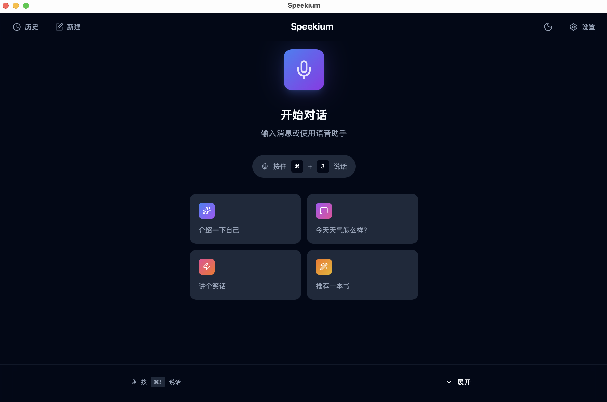
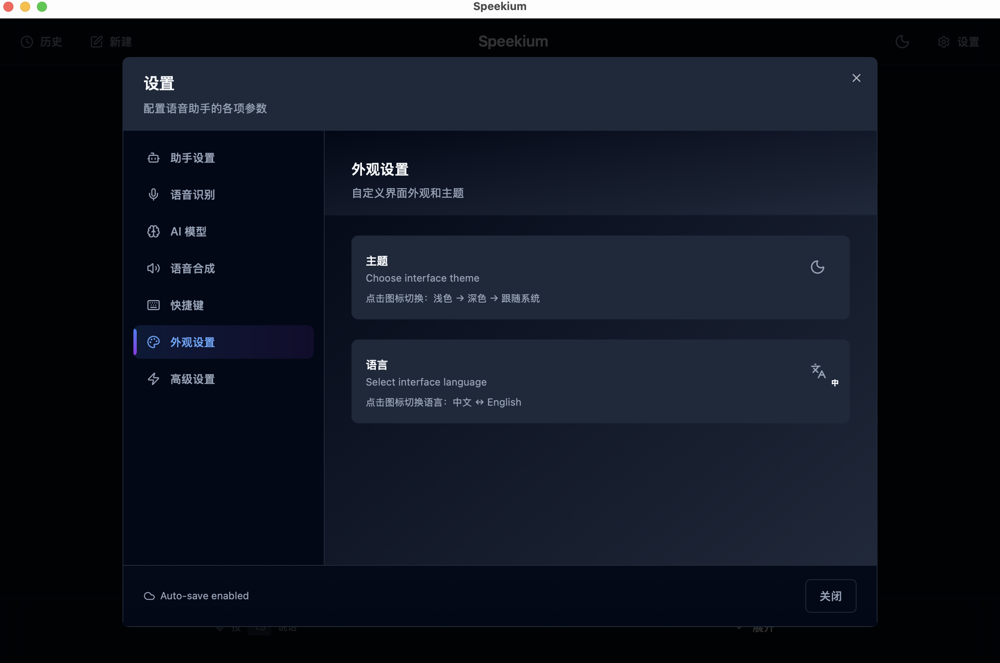
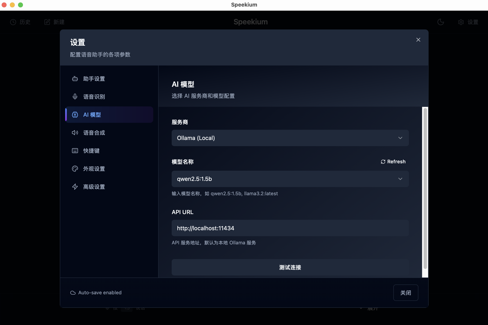
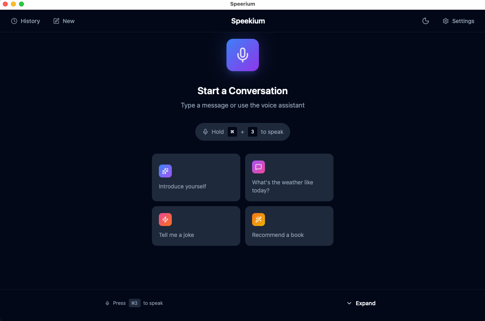

<p align="center">
  
</p>

<h1 align="center">Speekium</h1>

<p align="center">
  <strong>开源语音助手，尊重你的隐私。</strong>
</p>

<p align="center">
  <a href="./README.md">English</a> •
  <a href="#功能特性">功能特性</a> •
  <a href="#安装">安装</a> •
  <a href="#快速开始">快速开始</a> •
  <a href="#配置">配置</a>
</p>

<p align="center">
  <a href="https://github.com/kanweiwei/speekium/releases"></a>
  
  
  <a href="https://github.com/kanweiwei/speekium/stargazers"></a>
</p>

<p align="center">
  
  
  
  
</p>

---

<p align="center">
  
</p>

## 为什么选择 Speekium？

| 特性 | Speekium | Siri/小爱 | ChatGPT 语音 |
|------|:--------:|:---------:|:------------:|
| **本地运行** | ✅ | ❌ | ❌ |
| **数据隐私保护** | ✅ | ❌ | ❌ |
| **自选 LLM 模型** | ✅ | ❌ | ❌ |
| **开源免费** | ✅ | ❌ | ❌ |
| **支持离线使用** | ✅ | ❌ | ❌ |
| **无需订阅** | ✅ | ✅ | ❌ |

## 功能特性

### 语音输入模式
- **按键说话 (PTT)**：按住快捷键录音，松开发送
- **连续模式**：自动检测语音（VAD 语音活动检测）

### 工作模式
- **对话模式**：与 AI 对话，通过 TTS 听取回复
- **文字模式**：语音转文字，输入到任意应用

### LLM 后端
- **Ollama** - 完全离线运行本地模型
- **OpenAI** - GPT-4o、GPT-4o-mini、GPT-3.5-turbo
- **OpenRouter** - 访问 Claude、Gemini 等 100+ 模型
- **Claude Code CLI** - 直接 Claude 集成
- **自定义** - 任何 OpenAI 兼容的 API

### 更多功能
- 实时流式 TTS（Edge TTS）
- 深色/浅色主题
- 多语言支持（中文、英文）
- 自定义快捷键
- 对话历史记录

## 截图

<details>
<summary>点击查看更多截图</summary>

### 设置


### LLM 后端配置


### 深色 & 浅色主题


</details>

## 安装

### 下载安装（推荐）

下载适合你平台的最新版本：

| 平台 | 下载 |
|------|------|
| **macOS** (Apple Silicon & Intel) | [Speekium.dmg](https://github.com/kanweiwei/speekium/releases/latest) |
| **Windows** | [Speekium-setup.exe](https://github.com/kanweiwei/speekium/releases/latest) |

### 从源码构建

<details>
<summary>点击展开</summary>

**前置要求：**
- Node.js 20+
- Rust 1.70+
- Python 3.10+
- [uv](https://github.com/astral-sh/uv)（Python 包管理器）

```bash
# 克隆仓库
git clone https://github.com/kanweiwei/speekium.git
cd speekium

# 安装依赖
npm install
uv sync

# 开发模式运行
npm run tauri dev

# 构建生产版本
npm run tauri build
```

</details>

## 快速开始

### 1. 启动 Speekium

安装后打开应用，后台服务会自动启动。

### 2. 配置 LLM 后端

点击设置图标，选择你的 LLM 后端：

**使用 Ollama（离线）：**
```bash
# 先安装 Ollama
brew install ollama  # macOS
# 或从 https://ollama.ai 下载

# 拉取模型
ollama pull qwen2.5:7b
```

**使用 OpenAI/OpenRouter：**
在设置中输入你的 API Key。

### 3. 开始对话

- **PTT 模式**：按住 `⌘1`（Mac）或 `Ctrl+1`（Windows）录音
- **连续模式**：直接开始说话

## 配置

### 快捷键

| 操作 | macOS | Windows |
|------|-------|---------|
| 按键说话 | `⌘1` | `Ctrl+1` |
| 显示/隐藏窗口 | `⌘⇧Space` | `Ctrl+Shift+Space` |

> PTT 快捷键可在 设置 → 快捷键 中自定义

### 语音设置

| 设置 | 说明 | 默认值 |
|------|------|--------|
| VAD 阈值 | 语音检测灵敏度 | 0.5 |
| 静音超时 | 说话后等待时间 | 1.5秒 |
| TTS 语速 | 语音播放速度调整 | +0% |

## 架构

```
┌─────────────────────────────────────────────────────────────┐
│                   Speekium 桌面应用                          │
│                    (Tauri + React)                          │
├─────────────────────────────────────────────────────────────┤
│                                                              │
│   ┌─────────────┐    ┌─────────────┐    ┌─────────────┐    │
│   │    前端     │    │   Rust     │    │   Python    │    │
│   │   (React)   │◄──►│    后端    │◄──►│    服务     │    │
│   └─────────────┘    └─────────────┘    └─────────────┘    │
│                                                │             │
│                                          ┌─────┴─────┐      │
│                                          │           │      │
│                                     ┌────▼───┐ ┌────▼───┐  │
│                                     │  VAD   │ │  ASR   │  │
│                                     │(Silero)│ │(Sense- │  │
│                                     │        │ │ Voice) │  │
│                                     └────────┘ └────────┘  │
│                                                              │
└─────────────────────────────────────────────────────────────┘
                              │
                              ▼
              ┌───────────────────────────────┐
              │          LLM 后端             │
              ├───────────────────────────────┤
              │ Ollama │ OpenAI │ OpenRouter  │
              │ Claude │ 自定义 API           │
              └───────────────────────────────┘
```

## 技术栈

| 组件 | 技术 |
|------|------|
| 桌面框架 | [Tauri 2.0](https://tauri.app/) |
| 前端 | React 18 + TypeScript + Tailwind CSS |
| 后端 | Rust + Python |
| 语音活动检测 | [Silero VAD](https://github.com/snakers4/silero-vad) |
| 语音识别 | [SenseVoice](https://github.com/FunAudioLLM/SenseVoice) |
| 语音合成 | [Edge TTS](https://github.com/rany2/edge-tts) |

## 路线图

- [x] Tauri 桌面应用
- [x] 按键说话模式
- [x] 连续 VAD 模式
- [x] 多 LLM 后端支持
- [x] 流式 TTS
- [x] 对话历史
- [x] 多语言支持 (中/英)
- [x] 自定义快捷键
- [ ] 唤醒词检测
- [ ] 更多 TTS 引擎
- [ ] 插件系统
- [ ] Linux 支持

## 常见问题

<details>
<summary><b>麦克风无法使用</b></summary>

1. 检查系统麦克风权限
2. 尝试降低设置中的 VAD 阈值（如 0.3）
3. 确保没有其他应用正在使用麦克风

</details>

<details>
<summary><b>Ollama 连接失败</b></summary>

1. 确保 Ollama 正在运行：`ollama serve`
2. 检查模型是否已拉取：`ollama list`
3. 验证设置中的 Base URL（默认：`http://localhost:11434`）

</details>

<details>
<summary><b>TTS 无法播放</b></summary>

1. Edge TTS 需要网络连接
2. 尝试设置中的"预览 TTS"按钮
3. 查看控制台错误信息

</details>

## 贡献

欢迎贡献！你可以：

- 通过 [Issues](https://github.com/kanweiwei/speekium/issues) 报告 Bug
- 通过 [Discussions](https://github.com/kanweiwei/speekium/discussions) 提出建议
- 提交 Pull Request

## 许可证

[MIT](./LICENSE) © 2026 [Speekium](https://github.com/kanweiwei/speekium)

---

<p align="center">
  <strong>如果 Speekium 对你有帮助，请给个 ⭐</strong>
</p>

<p align="center">
  由开源社区用 ❤️ 打造
</p>
